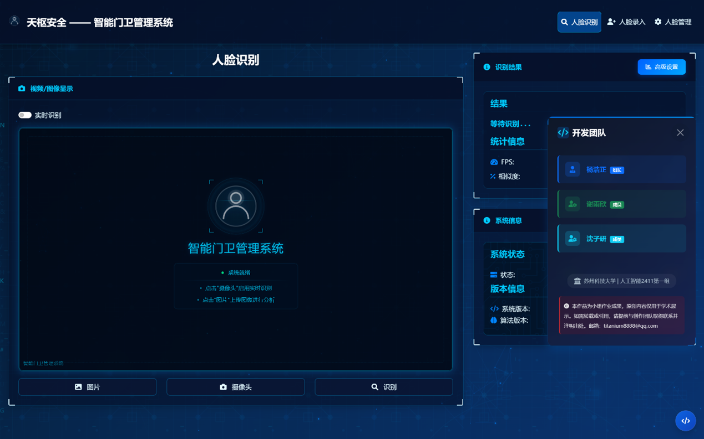

# **基于深度学习的智能门卫管理系统**（天枢安防 TianShu-Security）

## 项目简介

智能人脸识别系统依托**dlib 深度学习模型**与**Flask Web 框架**，构建集实时人脸识别、人脸数据管理及多源输入支持于一体的现代化门卫管理方案。目前该系统尚处雏形阶段，多项功能模块待进一步完善优化。





### 核心优势

- **隐私安全**: 本地部署，数据完全存储在本地服务器
- **高效识别**: 基于 ResNet 深度学习模型，识别准确率高达 99.38%
- **多端支持**: 支持PC端、移动端浏览器访问
- **多种输入**: 支持图片上传、摄像头实时识别、视频文件处理
- **一键部署**: 自动化安装脚本，快速部署上线

## 功能特性

### 人脸识别
- **实时识别**: 支持摄像头实时人脸识别
- **图片识别**: 上传图片进行批量人脸识别
- **视频处理**: 支持视频文件的人脸识别分析
- **多人检测**: 同时识别图像中的多个人脸
- **置信度评分**: 提供识别结果的置信度评分

### 人脸管理
- **人脸录入**: 支持多种方式添加人脸数据
- **数据库管理**: 可视化人脸数据库管理界面
- **批量操作**: 支持批量添加、删除人脸数据
- **数据导出**: 支持人脸特征数据的导出和备份

### 高级功能
- **特征聚类**: 使用 K-Means 算法优化人脸特征存储
- **FAISS加速**: 可选的 FAISS 库支持，大幅提升检索速度
- **质量评估**: 自动评估人脸图像质量，确保识别准确性
- **性能监控**: 实时显示识别耗时和系统性能指标

## 快速开始

### 环境要求

- **Python**: 3.7 或更高版本
- **操作系统**: Windows 10/11, macOS 10.14+, Ubuntu 18.04+
- **内存**: 建议 4GB 以上
- **摄像头**: 可选，用于实时识别功能

### 一键安装

1. **克隆项目**
```bash
git clone https://github.com/your-username/face-recognition-system.git
cd face-recognition-system
```

2. **运行启动脚本**
```bash
# Windows
python LaunchClient.py

# macOS/Linux
python3 LaunchClient.py
```

启动脚本将自动完成以下操作：
- 检查 Python 版本
- 安装必要的依赖包
- 下载并验证模型文件
- 创建必要的目录结构
- 启动 Web 服务器
- 自动打开浏览器

### 手动安装

如果需要手动安装，请按以下步骤操作：

1. **安装依赖**
```bash
pip install -r requirements.txt
```

2. **启动服务**

```bash
cd FaceWeb
python app.py
```

3. **访问系统**

打开浏览器访问：http://localhost:8888

## 系统架构

```
智能人脸识别系统/
├── FaceWeb/                       # Web应用主目录
│   ├── app.py                     # Flask主应用
│   ├── templates/                 # HTML模板
│   │   ├── index.html             # 系统首页
│   │   ├── recognition.html       # 人脸识别页面
│   │   ├── enrollment.html        # 人脸录入页面
│   │   └── management.html        # 人脸管理页面
│   └── static/                    # 静态资源
│       ├── css/                   # 样式文件
│       ├── js/                    # JavaScript文件
│       └── images/                # 图片资源
├── data/                          # 数据目录
│   ├── data_dlib/                 # dlib模型文件
│   ├── database_faces/            # 人脸数据库
│   └── features_all.csv           # 特征数据文件
├── LaunchClient.py                # 一键启动脚本
├── requirements.txt               # 依赖包列表
└── README.md                      # 项目说明文档
```

### 核心组件

| 组件 | 技术栈 | 功能描述 |
|------|--------|----------|
| **前端界面** | HTML5 + CSS3 + JavaScript | 现代化响应式Web界面 |
| **后端服务** | Flask + Python | RESTful API服务 |
| **人脸检测** | dlib + OpenCV | 人脸检测和特征提取 |
| **数据存储** | 本地文件系统 | 人脸图像和特征数据存储 |
| **性能优化** | FAISS + scikit-learn | 特征检索加速和聚类优化 |

## API文档

### 人脸识别接口

#### POST `/api/recognize`
识别上传的图片中的人脸

**请求参数:**
```json
{
  "image": "base64_encoded_image_data"
}
```

**响应示例:**
```json
{
  "success": true,
  "faces": [
    {
      "name": "张三",
      "confidence": 0.95,
      "bbox": [100, 100, 200, 200]
    }
  ],
  "performance": {
    "detection_time": 150.5,
    "face_count": 1
  }
}
```

#### POST `/api/recognize_frame`
识别视频帧中的人脸（实时识别）

#### POST `/api/add_face_image`
添加人脸图像到数据库

#### GET `/api/get_face_database`
获取人脸数据库信息

#### POST `/api/delete_face`
删除指定人脸数据

## 配置说明

### 系统配置

主要配置项位于 `FaceWeb/app.py` 文件中：

```python
# 服务器配置
DEFAULT_HOST = '0.0.0.0'
DEFAULT_PORT = 5000

# 人脸识别配置
FACE_RECOGNITION_TOLERANCE = 0.6  # 识别阈值
MAX_FACE_DISTANCE = 0.6           # 最大人脸距离

# 文件上传配置
UPLOAD_FOLDER = 'static/uploads'
MAX_CONTENT_LENGTH = 16 * 1024 * 1024  # 16MB
```

### 性能优化

1. **启用FAISS加速**（可选）
```bash
pip install faiss-cpu  # CPU版本
# 或
pip install faiss-gpu  # GPU版本（需要CUDA支持）
```

2. **启用特征聚类**（可选）
```bash
pip install scikit-learn
```

## 性能指标

| 指标 | 数值 | 说明 |
|------|------|------|
| **识别准确率** | 99.38% | 基于LFW数据集测试 |
| **识别速度** | ~150ms | 单张图片处理时间 |
| **支持人脸数** | 10,000+ | 推荐数据库规模 |
| **并发用户** | 50+ | 同时在线用户数 |

## 开发指南

### 本地开发

1. **设置开发环境**
```bash
# 创建虚拟环境
python -m venv venv

# 激活虚拟环境
# Windows
venv\Scripts\activate
# macOS/Linux
source venv/bin/activate

# 安装开发依赖
pip install -r requirements.txt
```

2. **启动开发服务器**
```bash
cd FaceWeb
python app.py --debug
```

### 代码结构

```python
# 核心类结构
class FaceRecognitionCore:
    def __init__(self):
        """初始化人脸识别核心"""
        
    def load_face_database(self):
        """加载人脸数据库"""
        
    def recognize_face(self, image):
        """识别人脸"""
        
    def add_face_image(self, name, image_data):
        """添加人脸图像"""
```

---


> **本项目仅为大一年级的一次小组作业，由于经验尚浅，难免存在疏漏与不足。如果这个项目对您有帮助，请给我们一个星标！**